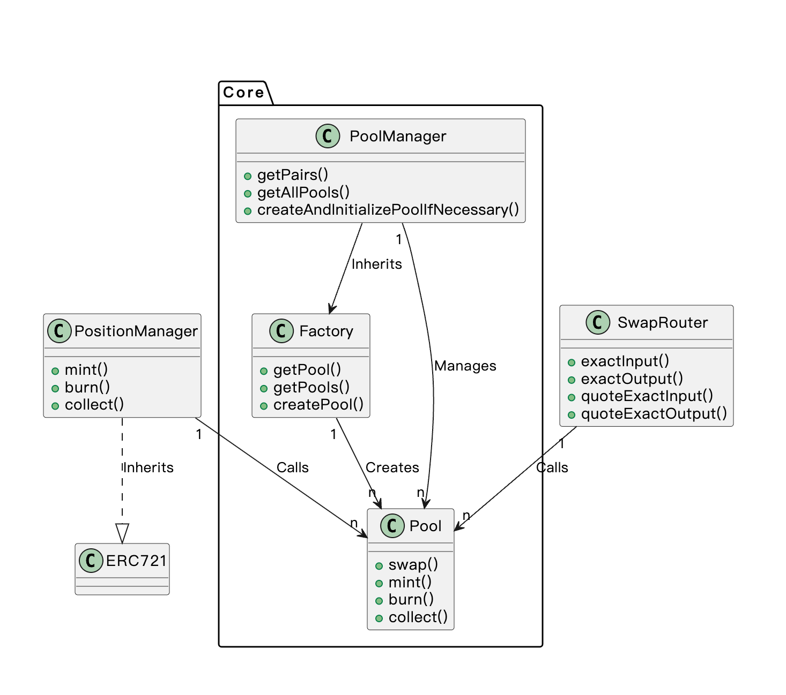
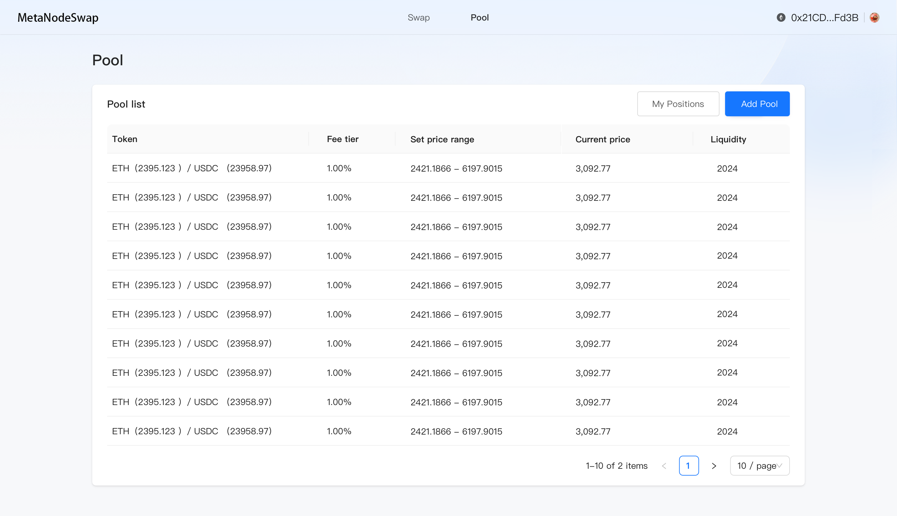
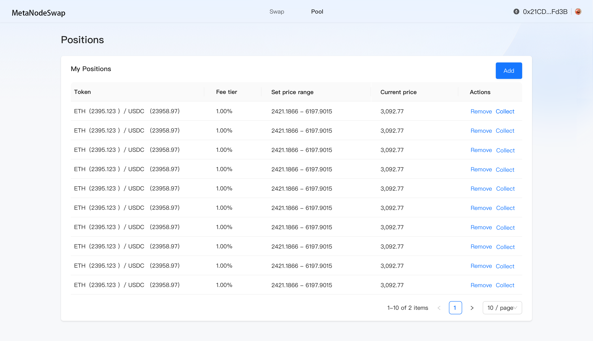
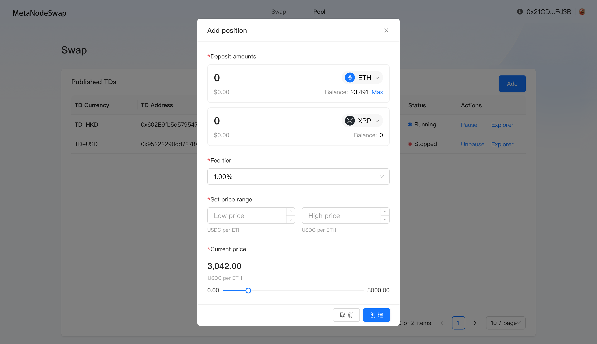
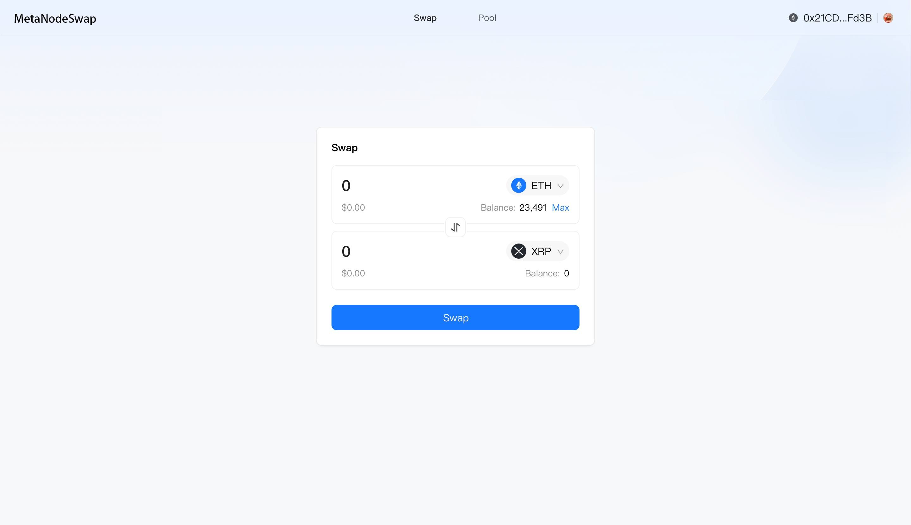

# MetaNodeSwap合约设计

## 合约需求描述

MetaNodeSwap 设计每个池子都有一个价格范围，swap 只能在此价格范围内成交

1. 任何人都可以创建池子，创建池子可以指定当前价格、价格范围： [a, b] 和 费率 f；相同交易对和费率可以有多个池子；不能删除和修改池子；
2. 任何人都可以添加流动性，添加流动性只能在指定价格范围 [a, b]，不能自定义范围；
3. 流动性提供者可以减少添加的流动性，并提取减少流动性对应的两种代币；
4. 流动性提供者可以在任何人 swap 过程收取手续费，手续费为 f，按流动性贡献加权平分给流动性提供者；
5. 任何人都可以 swap，swap 需要指定某个池子，swap 可以指定输入（最大化输出）或者指定输出（最小化输入），如果指定的池子的流动性不足，则只会部分成交。

以上手续费的收取方式和 Uniswap 有所差异，做了简化，会在后续手续费实现的章节继续展开说明。


## 合约结构

以简单为原则，我们不按照 Uniswap V3 将合约分为 `periphery` 和 `core` 两个独立仓库，而是自顶向下分为以下四个合约。

- `PoolManager.sol`: 顶层合约，对应 Pool 页面，负责 Pool 的创建和管理。
- `PositionManager.sol`: 顶层合约，对应 Position 页面，负责 LP 头寸和流动性的管理。
- `SwapRouter.sol`: 顶层合约，对应 Swap 页面，负责预估价格和交易。
- `Factory.sol`: 底层合约，Pool 的工厂合约；
- `Pool.sol`: 最底层合约，对应一个交易池，记录了当前价格、头寸、流动性等信息。

下面是合约的 UML 图：



## 合约接口设计

因为我们是自顶向下设计合约，因此我们首先分析前端页面（Pool 页面、Position 页面和 Swap 页面）需要哪些功能，并为此设计出顶层合约，再进一步分析细节，设计出底层合约。

#### PoolManager

`PoolManager.sol` 对应 Pool 页面，我们首先来看 Pool 页面有哪些功能。

首先是展示所有的 pool ，对应前端页面如下：



对应我们需要有接口支持 DApp 前端获取所有的交易池。在 Uniswap 中，这个接口是通过服务端提供的，服务端拉取链上的合约信息，然后返回给前端。但是我们的设计是直接调用合约获取当前可供交易的交易池，使得 DApp 不依赖于服务端（当然，对于实际项目来说，依赖服务端可能更合适）。为此，我们定义了 `getAllPools` 接口，用于获取所有的交易池，定义 `PoolInfo` 保存每个池子的信息。

```
struct PoolInfo {
    address token0;
    address token1;
    uint32 index;
    int24 fee;
    int24 tickLower;
    int24 tickUpper;
    int24 tick;
    uint160 sqrtPriceX96;
    uint128 liquidity;
}
function getAllPools() external view returns (PoolInfo[] memory poolsInfo);
```


每个 pool 的信息包括：

- token 对的符号以及数量；
- 费率;
- 价格范围；
- 当前价格；
- 流动性。

此外还有一个添加池子的操作，当添加头寸时如果发现还没有对应的池子，需要先创建一个池子。

参数包括：

- token0 的地址和数量；
- token1 的地址和数量；
- 费率（百分比）；
- 价格范围；
- 当前价格。

token0 的数量不为 0 或 token1 的数量不为 0 意味着添加初始流动性。

接口定义如下：

```
struct CreateAndInitializeParams {
    address token0;
    address token1;
    uint24 fee;
    int24 tickLower;
    int24 tickUpper;
    uint160 sqrtPriceX96;
}

function createAndInitializePoolIfNecessary(
    CreateAndInitializeParams calldata params
) external payable returns (address pool);
```


`PoolManager` 直接继承了 `Factory`（交易池的工厂合约），而不是通过合约调用来调用 `Factory`，所有交易池的创建都需要经过 `PoolManager`。你可以理解为 `PoolManager` 就是一个加强版的 `Factory` 合约。


#### PositionManager

`PositionManager.sol` 对应 Position 页面，我们首先来看 Position 页面有哪些功能

首先是展示当前地址创建的头寸，对应前端页面如下：



在我们的设计中 `PositionManager` 并不是必须的。因为理论上来说 LP 可以直接调用 `Pool` 合约来管理头寸，DApp 提供一个后端接口来获取 LP 的头寸信息。但是为了课程需要，我们设计了一个符合 ERC721 标准的 `PositionManager` 合约，用于管理 LP 的头寸。你可以理解为 `PositionManager` 就是一个代理，是一个中间商，帮助 LP 管理头寸。你也可以直接调用 `Pool` 合约来注入流动性，但是这部分头寸不会被 `PositionManager` 所感知。

```
import "@openzeppelin/contracts/token/ERC721/IERC721.sol";

interface IPositionManager is IERC721 {
    // 相关接口
}
```


`PositionManager` 合约就是一个 ERC721 的合约，LP 可以通过 NFT 的 id（对应我们定义为 `positionId`）来获取他创建的头寸信息，定义 `getPositionInfo` 方法，接口定义如下：

```
struct PositionInfo {
    address owner;
    address token0;
    address token1;
    uint32 index;
    uint24 fee;
    uint128 liquidity;
    int24 tickLower;
    int24 tickUpper;
    uint256 tokensOwed0;
    uint256 tokensOwed1;
}

function getPositionInfo(
    uint256 positionId
) external view returns (PositionInfo memory positionInfo);
```


每个头寸的信息包括：

- token 对的符号以及数量（这里的数量是头寸拥有的两种代币数量）；
- 费率；
- 价格范围；
- 添加的流动性；
- 收取的两种代币的手续费。

另外我们不单独定义获取所有头寸的接口，因为这个合约本身是一个 ERC721 的合约，所以我们可以通过类似 [ZAN Advanced API](https://zan.top/service/advance-api) 这样的服务来获取某个用户的所有的头寸（`zan_getNFTsByOwner`）。

接下来我们来看如何注入流动性（添加头寸），在 UI 设计的右上角有一个添加头寸的操作，点击弹出以下页面：



跟添加池子非常类似，只是不能填价格范围和当前价格，参数包括：

- token0 的地址和数量；
- token1 的地址和数量；
- 费率（百分比）。

定义 `mint` 方法，接口定义如下：

```
struct MintParams {
    address token0;
    address token1;
    uint32 index;
    uint256 amount0Desired;
    uint256 amount1Desired;
    address recipient;
    uint256 deadline;
}

function mint(
    MintParams calldata params
)
    external
    payable
    returns (
        uint256 positionId,
        uint128 liquidity,
        uint256 amount0,
        uint256 amount1
    );
```


值得注意的是，选定 token0 和 token1 两个下拉框，费率会自动显示。要想实现这个逻辑，我们需要依赖 `PoolManager.sol` 的接口，分别是：

- `getPairs`: 获取所有的交易对，用于 LP 选择交易对。
- `getAllPools`：获取所有的交易池信息，选择交易对后可以通过该方法获得全部的交易池，并按照 LP 选择的交易对等信息过滤。

`getPairs` 在上面的 PositionManager 中未定义，需要接口定义如下：

```
function getPairs() external view returns (Pair[] memory);
```


每行头寸的信息还有两个按钮，分别是 `burn` 和 `collect`，分别代表销毁头寸的流动性，以及提取全部手续费。

接口定义如下：

```
function burn(
    uint256 positionId
) external returns (uint256 amount0, uint256 amount1);

function collect(
    uint256 positionId,
    address recipient
) external returns (uint256 amount0, uint256 amount1);
```


#### SwapRouter

`SwapRouter.sol` 对应 Swap 页面，我们首先来看 Swap 页面有哪些功能

对应前端页面如下：



首先选定 token0 和 token1 也是两个下拉框，实现和 添加头寸 页面一致，只是不会展示费率，因此用户选择完交易对后会有多个池子。

DApp 需要分析出最优的 Swap 路径，这里用 `indexPath` 和 `sqrtPriceLimitX96` 两个参数。`indexPath` 的类型为 `uint32[]`，表示选取的池子的序号；`sqrtPriceLimitX96` 的类型为 `uint160`，表示每个池子交易的限价。逻辑如下：

- 先从 `indexPath` 中取出一个 `index` 确认池子；
- 在池子中进行 Swap，如果满足用户要求（即没有剩余的 `amount`）则结束；
- 如果触及 `sqrtPriceLimitX96` 限价，并且 Swap 还未满足用户要求（即剩余 `amount`），则扣除成交的 `amount`，回到第一步。如果已经是最后一个池子则以部分成交结束。

然后就是估算逻辑了，有以下两种方法：

- `quoteExactInput`：用户输入框输入 token0 的数量，输出框自动展示 token1 的数量；
- `quoteExactOutput`: 用户输出框输入 token1 的数量，输入框自动展示 token0 的数量；

接口定义如下：

```
struct QuoteExactInputParams {
    address tokenIn;
    address tokenOut;
    uint32[] indexPath;
    uint256 amountIn;
    uint160 sqrtPriceLimitX96;
}

function quoteExactInput(
    QuoteExactInputParams memory params
) external returns (uint256 amountOut);

struct QuoteExactOutputParams {
    address tokenIn;
    address tokenOut;
    uint32[] indexPath;
    uint256 amount;
    uint160 sqrtPriceLimitX96;
}

function quoteExactOutput(
    QuoteExactOutputParams memory params
) external returns (uint256 amountIn);
```


最后，当用户点击 Swap 按钮，有两种估算逻辑对应的方法 `exactInput` 和 `exactOutput`。

接口定义如下：

```
struct ExactInputParams {
    address tokenIn;
    address tokenOut;
    uint32[] indexPath;
    address recipient;
    uint256 deadline;
    uint256 amountIn;
    uint256 amountOutMinimum;
    uint160 sqrtPriceLimitX96;
}

function exactInput(
    ExactInputParams calldata params
) external payable returns (uint256 amountOut);

struct ExactOutputParams {
    address tokenIn;
    address tokenOut;
    uint32[] indexPath;
    address recipient;
    uint256 deadline;
    uint256 amountOut;
    uint256 amountInMaximum;
    uint160 sqrtPriceLimitX96;
}

function exactOutput(
    ExactOutputParams calldata params
) external payable returns (uint256 amountIn);
```


理论上来说，用户也可以直接调用 `Pool` 来交易。但是因为同一个交易对会有很多交易池，所以为了让用户交易更方便，我们设计了 `SwapRouter` 合约。DApp 通过分析交易池的情况，选择最优的交易池，然后由 `SwapRouter` 合约来调用 `Pool` 合约，一次性完成在不同交易池的交易。在 Uniswap 中也设计了类似的合约，只不过 Uniswap 是用来选择不同的交易对的，Uniswap 支持跨交易对的交易，比如用户想要交易 `A` 和 `C`，但是没有直接的交易对，那么 Uniswap 会选择 `A` 和 `B` 以及 `B` 和 `C` 两个交易对来完成交易。在本课程中，为了简化课程，我们不做这样的设计。但是因为我们在一个交易池上定义了不同的价格区间，所以我们也设计了 `SwapRouter` 合约来选择不同的价格区间的交易池。


#### Factory

`Factory.sol` 是 Pool 的工厂合约，比较简单，定义了 `getPool` 和 `createPool` 的方法，以及 `PoolCreated` 事件。

接口定义如下：

```
event PoolCreated(
    address indexed token0,
    address indexed token1,
    uint32 indexed index,
    address pool
);

function getPool(
    address token0,
    address token1,
    uint32 index
) external view returns (address pool);

function createPool(
    address token0,
    address token1,
    int24 tickLower,
    int24 tickUpper,
    uint24 fee
) external returns (address pool);
```


特别的，参照 Uniswap，工厂合约也设计成临时存储交易池合约初始化参数 parameters ，从而完成参数的传递。新增如下方法定义：

```
function parameters()
    external
    view
    returns (
        address factory,
        address token0,
        address token1,
        int24 tickLower,
        int24 tickUpper,
        uint24 fee
    );
```


#### Pool

`Pool.sol` 是最底层的合约，实现了 `MetaNodeSwap` 的核心逻辑。

首先是一些不可变量的读方法，如下：

```
function factory() external view returns (address);

function token0() external view returns (address);

function token1() external view returns (address);

function fee() external view returns (uint24);

function tickLower() external view returns (int24);

function tickUpper() external view returns (int24);
```


然后是当前状态变量的读方法，即当前价格、tick、流动性，以及不同头寸位置的流动性和代币数量，如下：

```
function sqrtPriceX96() external view returns (uint160);

function tick() external view returns (int24);

function liquidity() external view returns (uint128);
```


我们还要定义初始化方法，相比于 Uniswap，我们初始化时指定了价格范围，如下：

```
function initialize(
    uint160 sqrtPriceX96
) external;
```


最后是上层合约的底层实现，分别是 `mint`、`collect`、 `burn`、 `swap` 方法以及事件。

接口定义如下：

```
event Mint(
    address sender,
    address indexed owner,
    uint128 amount,
    uint256 amount0,
    uint256 amount1
);

function mint(
    address recipient,
    uint128 amount,
    bytes calldata data
) external returns (uint256 amount0, uint256 amount1);

event Collect(
    address indexed owner,
    address recipient,
    uint128 amount0,
    uint128 amount1
);

function collect(
    address recipient
) external returns (uint128 amount0, uint128 amount1);

event Burn(
    address indexed owner,
    uint128 amount,
    uint256 amount0,
    uint256 amount1
);

function burn(
    uint128 amount
) external returns (uint256 amount0, uint256 amount1);

event Swap(
    address indexed sender,
    address indexed recipient,
    int256 amount0,
    int256 amount1,
    uint160 sqrtPriceX96,
    uint128 liquidity,
    int24 tick
);

function swap(
    address recipient,
    bool zeroForOne,
    int256 amountSpecified,
    uint160 sqrtPriceLimitX96,
    bytes calldata data
) external returns (int256 amount0, int256 amount1);
```


特别的，还需要定义两个回调接口，分别用于 pool 合约 `mint` 和 `swap` 的回调。接口定义如下：

```
interface IMintCallback {
    function mintCallback(
        uint256 amount0Owed,
        uint256 amount1Owed,
        bytes calldata data
    ) external;
}

interface ISwapCallback {
    function swapCallback(
        int256 amount0Delta,
        int256 amount1Delta,
        bytes calldata data
    ) external;
}
```